# **Programming: introduction**

Программирование - это процесс создания компьютерных программ, которые могут            
выполнять различные задачи. Программы могут использоваться для решения разных            
задач, от простых математических вычислений до управления сложными системами.

Для создания программы используется **язык программирования** - это набор правил и              
инструкций, которые компьютер может понимать и выполнять. Языки              
программирования бывают разными, и каждый язык имеет свои особенности,                  
синтаксис и возможности.

## **Areas of use**

**Где в современном мире может применяться программирование:**

1) `Wev Dev:` создание веб-сайтов и веб-приложений с помощью языков программирования           
(HTML, CSS, JavaScript, Python, PHP, Ruby etc.)        

2) `Mobile Dev:` создание приложений для мобильных устройств            
(Java, Kotlin, Swift, Objective-C, etc.)        

3) `Desktop app Dev:` создание программ, которые устанавливаются на компьютер                  
пользователя и выполняются на нем (Java, C++, Python, C#, etc.)           

4) `Game Dev:` создание компьютерных игр с помощью специализированных игровых            
движков и языков программирования (Unity, Unreal Engine, C++, C#, etc.)

5) `Process Automation:` создание программ, которые автоматизируют рутинные задачи            
и упрощают процессы в различных сферах, от бизнеса до науки. В этом случае            
используются языки программирования, такие как Python, Ruby, PowerShell и другие.          

6) `AI, ML, DS:` создание программ, которые могут обучаться на основе данных и            
принимать решения на основе алгоритмов и статистических моделей           
(Python, R, MATLAB, etc.)

---

# **What's the difference?**

В целом, языки программирования могут дробиться на лагери по некоторым критериям:         

1) Процесс выполнения кода:
    * Компилируемые
    * интерпретируемые

   2) "Уровень" языка:
      * Высокоуровневые
      * низкоуровневые


### **Компилируемые языки** - это языки, которые требуют предварительной компиляции          
программы перед ее запуском.           

**Компиляция** - это процесс преобразования кода программы в машинный код,         
который может быть выполнен компьютером (C, C++, Java, Kotlin, Rust,           
Go, Swift, Objective-C, Pascal)

В компилируемых языках программирования программа должна быть скомпилирована в          
машинный код до ее запуска, что может занимать время и требовать дополнительных ресурсов.          


Давайте разберемся в этой теме. Представьте, что мы с вами - повара,        
у нас есть рецепт блюда, и нам нужно, чтобы наш помощник (компьютер)       
приготовил это блюдо. Вот компилируемые языки программирования - это как раз          
такие рецепты, которые нужно подготовить заранее перед тем, как начать готовить.

Мы с вами - повара в ресторане и у нас есть список блюд, которые гости заказали для банкета.          
Прежде чем начать готовить, мы берём каждый рецепт и записываем его на специальной           
карточке. Это как **компиляция** - перевод рецепта (кода программы) на специальный           
язык, который понимает наш помощник (компьютер).

Когда у нас уже есть все карточки с рецептами, мы начинаем готовить. Наш           
помощник читает каждую карточку и следует инструкциям, чтобы приготовить блюдо.          
Так и компьютер, имея скомпилированный код (карточку с рецептом), может выполнять программу.

Компилируемые языки программирования, такие как **C, C++, Java** и другие, требуют этой            
подготовки (компиляции) перед тем, как программа будет запущена. Это может занять некоторое          
время, как если бы мы тратил время на запись всех рецептов. Но как только это сделано,         
компьютер может более быстро готовить блюда (выполнять программу), так как он знает,           
как именно это делать, и может делать это оптимальным образом.

Также, как мы можем обнаружить ошибки в рецептах, когда записываем их, компиляторы для          
компилируемых языков могут помочь выявить ошибки в программе до ее запуска. Это как если           
бы наш помощник замечал, что в рецепте написано что-то нелогичное или неправильное.

Так что **компилируемые языки программирования** - это как рецепты, которые нужно перевести           
на специальный язык для компьютера и подготовить заранее, чтобы потом быстро        
и правильно выполнять программу.       


**Общая схема работы компилятора:**

---

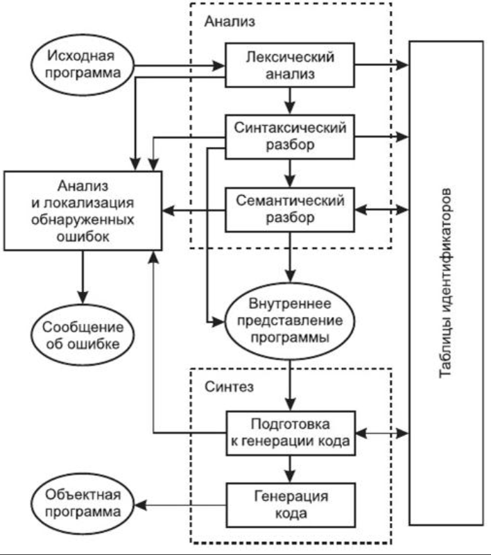

---

### **Интерпретируемые языки:**

**Интерпретируемые языки программирования** - это языки, которые НЕ требуют предварительной          
компиляции. Вместо этого программа интерпретируется на лету в процессе ее выполнения       
компьютером. **Интерпретация** - это процесс прочтения и выполнения кода программы на        
выбранном языке программирования без предварительной компиляции (Python, JavaScript, Ruby, etc.)         

В интерпретируемых языках программирования программа может быть выполнена         
немедленно без необходимости предварительной компиляции, но это может занимать        
больше времени на выполнение.

С другой стороны, интерпретируемые языки обычно более гибкие и могут быть более         
удобны для быстрого разработки прототипов программ.          

Представим, что мы - гид по музею, и наши гости - компьютеры, которые хотят узнать          
интересные истории о каждой картине. Вот **интерпретируемые языки программирования** - это            
как мы рассказываем истории на ходу, как только группа гостей подходит к картине.             

Допустим, у нас есть много историй о разных картинах, но мы не знаем заранее,           
какие именно гости придут и к каким картинам они захотят послушать истории.            
Вместо того чтобы написать заранее все рассказы (как в компилируемых языках),         
мы готовимся к посетителям, но рассказываем истории только тогда, когда нас об этом попросят.        

Каждый раз, когда гости подходят к картине, мы сразу начинаем рассказывать про нее.         
Мы не делаем заранее записи всех рассказов (компиляции), а интерпретируем и рассказываем           
историю на месте. 

Это как интерпретация кода программы - компьютер читает и выполняет команды на         
лету, без предварительной подготовки.

Интерпретируемые языки программирования, такие как Python, JavaScript и Ruby,         
позволяют запускать программы без предварительной компиляции. Программа может быть          
выполнена сразу, как только компьютер встретит ее код. Это может занять немного больше          
времени, чем если бы программа была заранее "приготовлена", но они позволяют более         
гибко и быстро разрабатывать и изменять программы, подобно тому, как мы можем рассказывать          
разные истории о картине, в зависимости от того, что интересует наших гостей.


**Общая схема работы интерпретатора:**

---

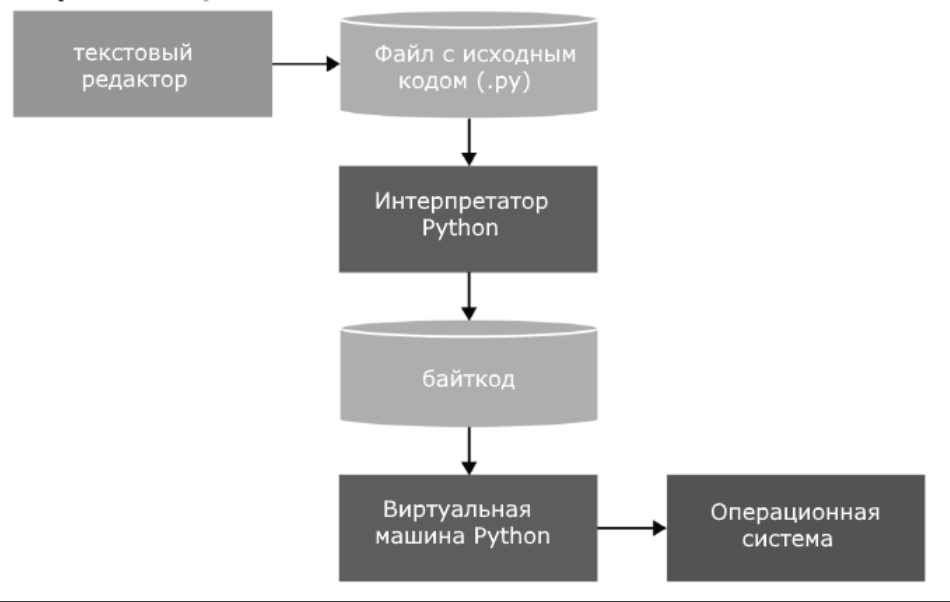

---


### **Уровень абстракции языков:**

Основная разница между **высокоуровневыми** и **низкоуровневыми** языками программирования          
заключается в том, насколько абстрактным уровнем аппаратуры занимается язык.

**Низкоуровневые языки** предназначены для написания программ, которые выполняются напрямую         
на компьютере. Такие языки дают программистам полный контроль над машиной и позволяют им            
манипулировать конкретными элементами аппаратуры. Программист напрямую управляет          
аппаратной частью компьютера, включая распределение памяти для переменных, управление         
процессором, работой с регистрами, использованием инструкций машинного кода и т.д. 

Всё это может быть полезно, например, при разработке операционных систем, драйверов          
устройств и других задач, связанных с непосредственным взаимодействием           
с аппаратурой. (Assembler, C,Rust, Ada, Fortran, Go, D)

**Высокоуровневые языки** предоставляют программистам более высокий уровень абстракции.          
Они предоставляют высокоуровневые конструкции и функции, которые позволяют программистам       
решать задачи на более высоком уровне, не вдаваясь в детали работы        
аппаратуры (Python, Java, C++, etc)


# **Python: introduction**

Впервые язык [Python](https://www.python.org/) был анонсирован в 1991 году голландским разработчиком Гвидо Ван Россумом.           
С тех пор данный язык проделал большой путь развития. В 2000 году была издана версия           
2.0, а в 2008 году - версия 3.0. Несмотря на вроде такие большие промежутки между версиями         
постоянно выходят подверсии. Так, текущей актуальной версией Python является 3.11.3,        
однако так же уже существует и 3.12, однако она находятся в стадии доработок и багфиксов.

Python представляет собой популярный высокоуровневый язык программирования,        
который может применяться в следующих сферах:

1) **Data Science**:
   * `Data Analysis`
   * `Data Engineering`
   * `ML`
   * `AI`


2) **Web-development**:
   * `Web applications`
   * `Web site`
   * `API development`


3) **QA & Processes automatization**:
   * `парсинг данных`
   * `автоматическая обработка документов`
   * `автоматизация тестирования программного обеспечения`


4) **Game Dev**:
   * `разработка компьютерных игр и создания игровых движков`
   * `создание сценариев и автоматизации задач в игровой индустрии`


5) **Fin Tech**:
   * `анализ рынков`
   * `моделирование рисков`
   * `создание приложений для торговли на фондовых рынках`


---


# **Основные особенности Python**

1) **Скриптовый язык**. Код программ определяется в виде скриптов.
2) **Поддержка самых различных парадигм программирования**, в том числе        
бъектно-ориентированной и функциональной парадигм.
3) **Интерпретация программ**. Для работы со скриптами необходим интерпретатор,     
который запускает и выполняет скрипт.

**Выполнение программы на Python выглядит следующим образом:**
   * Сначала мы пишем в текстовом редакторе скрипт с набором выражений.
   * Передаем этот скрипт на выполнение интерпретатору.
   * Интерпретатор транслирует код в промежуточный байткод, а затем виртуальная         
   машина переводит полученный байткод в набор инструкций,          
   которые выполняются операционной системой.

4) Портативность и платформонезависимость. Не имеет значения, какая у нас          
операционная система - Windows, Mac OS, Linux, нам достаточно написать скрипт,        
который будет запускаться на всех этих ОС при наличии интерпретатора
5) Автоматическое управление памяти
6) Динамическая типизация


---

# **Различие синтаксиса**

**Python** отличается достаточно лёгким, интуитивно понятным (на фоне некоторых языков)        
языком программирования. Он допускает в себе отвутствие символа точки с запятой ";",        
фигурных скобок "{}" явного определения переменных через ключевые слова и пр.

Собственно вот несколько примеров:

---

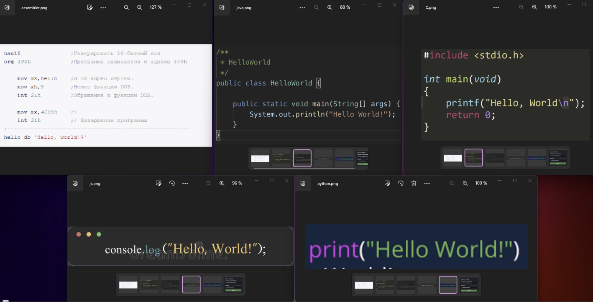

---

# **Установка Python**

Для написания какого-то кода на языке Python нам необходим интерпретатор.       
Его можно найти и установить на компьютер на [офф сайте](https://www.python.org/downloads/)
При установке в самом низу обязательно поставьте галочку над полем `PATH`

Обладатели же `unix` систем, таких, как `Mac OS`, `Linux` должны уже иметь внутри         
системы этот язык. Это можно проверить, набрав в терминале команду:

```commandline
python3 --version
```
---


# **IDE**

### **PyCharm**

* Создатель `JetBrains`
* Закрытый исходник
* Поддержка `Windows`, `MacOS` и `Linux`


Разработан под `Python`, `Javascript`, `Coffeescript`, `Typescript`, `HTML/CSS`, `AngularJS`,          
`Node.js` и другие языки. Возможности интегрированного модульного тестирования,             
проверки кода, интегрированного контроля версий, инструменты рефакторинга кода,          
набор инструментов для навигации проекта, выделения и автоматического завершения.         
Поддержка ряда сторонних фреймворков для веб-разработки, таких как `Django`, `Pyramid`,        
`web2py`, `Google App Engine` и `Flask`, что делает его универсальной `IDE` для       
быстрой разработки приложений.

[PyCharm](https://www.jetbrains.com/pycharm/)


### **Visual Studio Code**

* Прекрасный IDE, поддерживающий разработку на многих языках
* Полностью бесплатный, мощный
* Поддержка всех видов ОС


Легковесная и мощная `IDE` для разработки на разных языках (в основном гуд заходят       
`JS` И `Python`). Среди ее преимуществ - отличная поддержка Python с функциями автодополнения,        
отладчиком и интеграцией с `Jupyter Notebook`; возможность установки дополнительных         
расширений для повышения производительности и комфорта; интеграция с `Git` и другими         
системами контроля версий; поддержка различных операционных систем, включая `Windows`         
В то же время, у `VS Code` есть некоторые недостатки, такие как возможные         
проблемы с быстродействием на более слабых компьютерах и некоторые ограничения         
в функциональности, сравнимые с другими более мощными `IDE`.

[VS Code](https://code.visualstudio.com/)


---


# **Variables**

**Переменная** — это каким-либо образом проименованная и/или адресованная область физической           
или виртуальной памяти. Предназначенна для хранения данных (значений). С помощью переменной         
можно проводить различные операции с данными и обеспечить программе необходимую гибкость.          


**Переменная** может хранить в себе различные данные ( исходя из задекларированных          
типов данных в определённом языке ). Её можно расценивать, как своего рода коробку, в         
которую мы будем что-то ложить и пользоваться этим в течение "жизни" этой переменной.          
Название такое она получила за счёт того, что значение в ней может меняться         
( как и сам тип данных, но не всегда ).


**Чем же они так "популярны"?**

Представьте, что нам нужно напечатать на экране фразу `"Hello, World!"` два раза.       
Эту задачу можно решить так:

```python
print("Hello, World!")
print("Hello, World!")
```

И в целом это будет работать, почему нет!

А теперь представьте, что у вас есть файл, в котором содержится порядком **1000 строк**        
и такую надпись вы много где используете в этом файле. Уже не так удобно получается,        
верно? Ведь придётся прописывать одно и то же множество раз подряд, что приводит       
к дублированию кода, а это не самая лучшая практика.


**Усложним задачу:**

Всё работает и все довольны, но к вам пришли и сказали, что теперь хотят, чтобы была        
новая фраза: "Greeting, User!" Теперь вам придётся проходить ПО ВСЕМУ файлу и         
искать места, где появлялась эта фраза и менять её.

А можно создать переменную и поместить в неё наше приветствие, за счёт чего мы         
облегчим задачу себе и не будем нагружать код сотнями повторений:

```python
greeting = "Greeting, User!"

print(greeting)
```

В строчке `greeting = "Greeting, User!"` мы берем переменную с именем `greeting` и         
присваиваем ей значение `"Greeting, User!"`. Переменная указывает на данные, которые в неё         
записали. Благодаря этому данные можно использовать многократно и не дублировать их постоянно.      


---

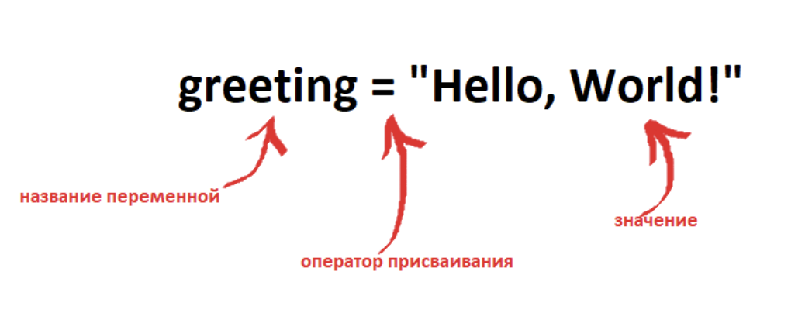

---

Когда переменная создана, можно ее использовать. Она подставляется в те места, где         
раньше стояла наша фраза. Когда код выполняется, интерпретатор доходит до строчки        
`print(greeting)` и подставляет содержимое переменной, а затем выполняет код.        


# **Правила создания переменных**

**Как же правильно создавать переменные и что нужно учитывать?**


**Идентификаторы** (названия переменных) могут быть комбинацией букв нижнего регистра         
(от `a` до `z`) или прописных (от `A` до `Z`), цифр (от `0` до `9`) или символа подчеркивания          
`_`. Такие имена, как `myClass`, `var_1` и `print_this_to_screen`,         
являются допустимым примером.


* Переменная не может начинаться с цифры.
* Ключевые слова нельзя использовать в качестве идентификаторов
* Мы не можем использовать специальные символы, такие как `!`, `@`, `#`, `$`, `%` и т.д.
* Переменная может быть любой длины ( но лучше не перебарщивать )
* Ваша переменная должна отражать заложенный логический смысл того, что в ней лежит.


Так же стоит учитывать, что переменные в **Python** чувствительны к регистру. Одно и          
то же название переменной в разных регистрах будет разными переменными:       

```python
# myAwesomeVariable # camelCase
# my_awesome_variable # snake_case
```

```python
qwe = 5
QWE = 10
Qwe = 15

print(qwe, QWE, Qwe)
```


## **Зарезервированные имена переменных**

**Ключевые слова** — это зарезервированные слова в **Python**. Мы не можем использовать ключевое         
слово в качестве имени переменной, имени функции или любого другого идентификатора.         
Они используются для определения синтаксиса и структуры языка **Python**.

Все ключевые слова, кроме `True`, `False` и `None`, написаны в нижнем регистре и должны          
быть записаны как есть.

Чтобы узнать какие же слова нельзя использовать в качестве переменных,        
можно ввести следующую команду:

```python
help("keywords")
```

---

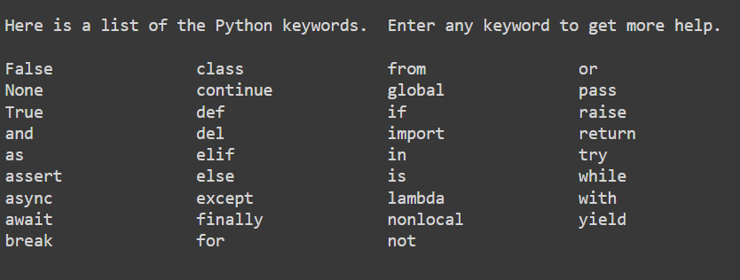

---

### **Как изменять переменные**

Само слово «переменная» подсказывает, что ее можно менять. И действительно,        
со временем внутри программы значения переменных могут изменяться:        

```python
# greeting - переводится как приветствие
greeting = 'The first sample of text'
print(greeting)  # => The first sample of text
```

```python
greeting = 'QWERTY!'
print(greeting)  # => QWERTY!
```

```python
greeting = 123
print(greeting)
```

Обратите внимание, что сама переменная у нас осталось той же,         
поменялось именно её содержимое.


# **Как работают переменные?**

Переменная является именованной областью памяти. После того как вы          
дали имя области, появляется возможность обращаться к данным, что в ней хранятся.       

Каждый элемент данных в `Python` является объектом определенного типа или         
класса. Когда, в процессе выполнения программного кода, появляется новое значение,          
интерпретатор выделяет для него область памяти — то есть создаёт объект          
определенного типа (число, строка и т.д.). После этого `Python` записывает в          
свой внутренний список адрес этого объекта.

Но как теперь получить доступ к созданному объекту? Для этого и существуют        
переменные — они дают возможность удобно работать с объектами используя       
имена вместо адресов. Проще говоря - наши с вами переменные - просто именна,          
прикреплённые к определённому объекту, в котором лежит что-то, что мы туда положили.


Создадим с вами новую переменную, присвоим ей какое-то значение, а         
после посмотрим на это значение, на его тип и на его ячейку памяти:      

```python
a = 123

print(a)
print(type(a))
print(id(a))
```

В примере выше мы создали переменную a и присвоили ей значение `123`,          
далее вывели ее значение, тип и адрес объекта в памяти.

---

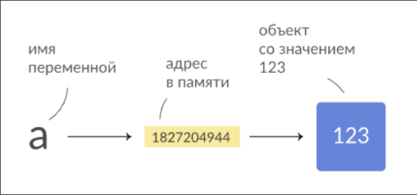

---


Представьте, что у вас есть много непрозрачных бутылок. Вы залили в каждую из        
них разный сок, или напиток и после запечатали все эти бутылки.         
Резонный вопрос: как теперь понять содержимое отдельно взятой бутылки?

Ответ: предварительно их подписать. Сделав это, вы будете точно знать,      
что находится в бутылках.

Бутылок в какой-то момент у вас становится много и для хранения соков пришлось         
арендовать склад, где каждая бутылка находится строго на своём месте.         
Теперь у вас есть ещё и специальные карточки: на каждой из них записаны название       
сока и адрес этого сока на складе. Когда требуется достать конкретную        
бутылку с соком, вы посмотрите на карточку, прочтёте номер ячейки, а         
затем пойдёте к обозначенному месту на складе и возьмёте оттуда нужную бутылку.


**В данном примере:**
* `переменная` — карточка c конкретной бутылкой с соком;
* `адрес` — это номер ячейки на складе;
* `объект` — сама ячейка;
* `данные` — бутылка с соком внутри.


Чтобы понимать работу переменных нам нужно разобрать, что происходит           
"под капотом" в момент создания новой переменной и присваивания ей значения:

```python
a = 100
```

**Что у нас тут происходит:**

* Создаётся объект типа `int` со значением `100`
* Создаётся переменная `a`
* В переменной `a` сохранится адрес (ссылка) на объект

---

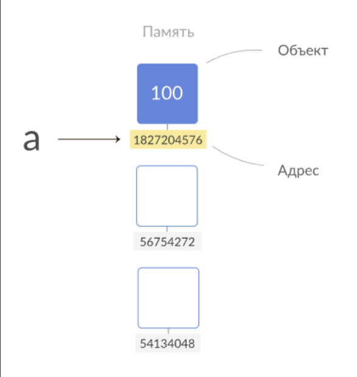

---


Очень важно не забывать, что переменная в Python не хранит         
значение напрямую — она хранит лишь ссылку на объект

Теперь посмотрим что произойдет, если одной переменной присвоить другую переменную:       

```python
a = 100
b = a

print(a, b)
print(id(a), id(b))
```

В этом примере Python не создает нам новый объект — он просто создает         
переменную, которая ссылается на тот же объект, что и переменная `a`

---

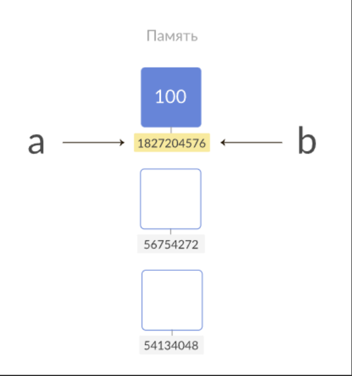

---

Теперь же давайте глянем, что будет, если мы захотим поменять        
значение для нашей переменной `b`:

```python
b = 500

print(a)
print(b)
print(id(a))
print(id(b))
```

В этом примере уже наш `Python` создаёт новый объект типа `int` и присваевает            
ему наше значение. Так как был создан новый объект - у           
переменной `b` теперь своя ячейка памяти:

---

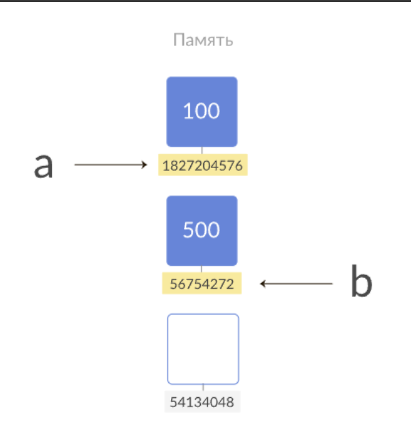

---

Теперь давайте посмотрим ещё один пример: Зададим новое значение нашей переменной `b`:        

```python
b = "text"

print(id(b))
```

На объект типа `int` со значением `500` больше не ссылается никакая переменная.           
Следовательно, он больше не доступен и будет удален сборщиком          
мусора (тем самым освободив немного памяти).

---

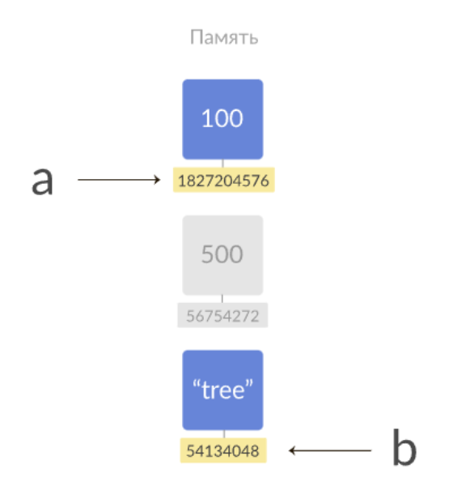

---

Помните, что Идентификатор объекта — это адрес нашего объекта в памяти.           
В примерах выше мы использовали функцию `id()` Эта функция возвращает число,         
которое является неизменным и уникальным для каждого объекта на протяжении          
его жизненного периода:

```python
q = w = 200

print(id(q))
print(id(w))
print(id(200))
```

---

# **Арифметические операторы в Python**

Что у нас собственно по операторам вычислений? В Питоне они следующие:

* `-` — вычитание
* `*` — умножение
* `**` — возведение в степень (а если возвести в степень 0.5, то можно получить       
квадратный корень)
* `/` — деление (при делении чисел получается float)
* `//` — целочисленное деление
* `%` — остаток от деления


Однако и тут не так всё легко, как может показаться. Так же, как и в математике,        
в Питоне есть **приоритетность** для операторов. Вот наша с вам иерархия приоритетов       
от высокого к низкому ( для операторов вычесления ):

* Возведение в степень `**`
* Деление `/` Остаток от деления `%` Умножение `*`
* Вычетание `-` Сложение `+`
* Операторы сравнения `in`, `not in`, `is`, `is not`, `<`, `<=`, `>`, `>=`, `<>`, `!=`, `==`


```python
# Сначала выполняется умножение
# потом операция сложения
# Результат: 17
5 + 4 * 3
```

Так же мы можем определять приоритет сами, взяв нужный нам кусок          
выражения в круглые скобки:

```python
# Круглые скобки () переопределяют приоритет арифметических операторов
# Вывод: 27
(5 + 4) * 3
```

Некоторые группы включают по несколько операторов python. Это значит, что все        
представители одной группы имеют один уровень приоритетности.

При наличии двух или более операторов с одинаковым уровнем в дело вступает        
ассоциативность, определяющая порядок.

Например, у операторов умножения и деления приоритетность одинаковая. В одном          
выражении тот, что находится слева, будет выполняться первым.

```python
# Тестирование ассоциативности слева направо
print(4 * 7 % 3)

print(2 * (10 % 5))
```

Однако это не касается нашего оператора возведения в степень            
(даже с использованием круглых скобок):

```python
# Проверка ассоциативности с оператором степени
print(4 ** 2 ** 2)

print((4 ** 2) ** 2)
print(25 ** 0.5)
```

---

**Ассоциативность** — это порядок, в котором **Python** выполняет выражения,          
включающие несколько операторов одного уровня приоритетности. Большая часть         
из них поддерживают ассоциативность слева направо (за исключением         
оператора возведения в степень **).

**Неассоциативные операторы**

Наши с вами операторы сравнений не поддерживают ассоциативность. Для          
них применяются специальные правила порядка, в которых ассоциативность      
НЕ принимает участия.

Например, выражение `5 < 7 < 9` — это не то же самое, что и `5 < (7 < 9)`.         
Зато `5 < 7 < 9` — то же самое, что `5 < 7` и `7 < 9`. Исполняется слева направо.         


Так же работает связывание операторов присваивания (например, `a=b=c`),         
а вот `a = b += c` вернет ошибку.


```python
a = q = 5
a = 1

print(a)
print(q)
print(id(a))
print(id(q))
```

---

# **Типизация данных в Python**

Как мы обсуждали ранее, **Python** - язык динамический.

Всякий раз, когда мы пишем программу на **Python**, мы сталкиваемся с разными       
наборами операторов, один из которых является оператором присваивания        
( = ), в котором мы инициализируем переменную со значением.


Когда мы говорим о таких языках, как **C, C ++ и Java**, память распределяется на        
основе типа данных переменной, и к ней обращаются соответственно, тогда как python       
является динамически типизированным языком, он сохраняет значение в каком-то        
месте (**в ячейке памяти**), а затем объединяет соответствующее имя        
переменной с контейнером.

Тип данных определяется во время выполнения:

```python
a = 12.0
print(type(a))
b = 24
print(type(b))
c = 'data'
print(type(c))
print(a * 3)
print(b * 3)
print(c * 3)
```

Шо, собственно, у нас тут происходит-то? На старте мы инициализируем ( создаём )       
ТРЫ переменных: `a`, `b`, и `c`, и присваиваем им наши значения ( дробное число,         
целое число и строку )

Дальше мы проверяем тип данных наших переменных ( Всё благодаря методу `type()` )        
И после всего этого мы проводим одно и то же действие с нашими переменными - умножаем            
их на тройку. Но результат у нас будет разным, за счёт того, что наш Питон при          
проходе по коду определил тип данных для каждой из переменных. На выходе мы            
молучаем так же дробное число, целое число и строку.

Так же Питон поддерживает такой прекрасный синтаксический сахар ( которым пользуются        
не все к сожалению ), как определение типа переменной в момент          
её определения. Как это работает:

```python
my_int: int = 83
my_string: str = "Hello!"
my_float: float = 4.1
```

Что поменялось: теперь наша переменная имеет очевидный, присвоеный ей тип данных.        

Это может помочь разработчику не запутываться в том, а что же у него в переменной            
будет / может лежать и так же предотвратить попадание в эту переменную          
какого-то другого типа данных. Это что касается сред разработки.

---

# **Типы данных в Python**

В Python, типы данных могут быть **изменяемыми** и **неизменяемыми**.          

**Неизменяемые** типы данных означают, что значения, которые хранятся        
в таких объектах, не могут быть изменены после создания объекта.         

**Изменяемые** типы данных, напротив, могут изменять значение внутри объекта.          


В целом же наши данные в Python бывают:
* Базовые типы данных
* Коллекции


К базовым типам данных мы можем отнести:

* **Числовые типы данных**
   * `int`: целочисленные значения
   * `float`: числа с плавающей точкой (дробные числа)
   * `complex`: комплексные числа

* **Логический тип данных**
   * `bool`: логический тип данных

* **Строковый тип данных**
   * `str`: строки

* **NoneType**
   * `None`: тип данных, который указывает на отсутствие значения

Каждый из этих типов данных имеет свои собственные операции, которые можно          
выполнять с помощью встроенных функций и операторов языка Python.


Что же до наших более сложных структур данных - коллекций, тут всё веселее!
Наши коллекции состоят из:

* **Последовательностей** ( индексированные, элементы не уникальны )
   * Изменяемые
      * список(`list`)
   * Неизменяемые
     * строки(`str`)
     * кортежи(`tuple`)

* **Множества** ( неиндексированные, элементы уникальны )
   * Изменяемые
     * множества(`set`)
   * Неизменяемые
     * неизменные множества(`frozenset`)

* **Отображения** ( Неиндексированный набор пар <ключ: значение> )
   * словари(dict)

---

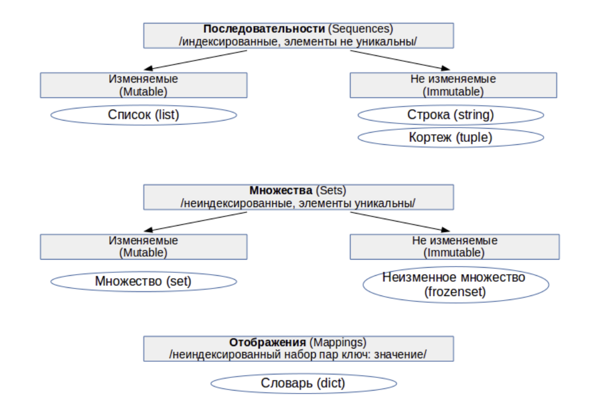

---

Чтобы вам было проще запомнить: Изменяемые типы данных - первые буквы           
наших типов данных `List`, `Set`, `Dict` - `LSD`


### **Подведём небольшие итоги:**

Типы данных в Python у нас могут быть изменяемыми и неизменяемыми. К изменяемым          
у нас относятся `List`, `Set`, `Dict` ( `LSD`, не забываем ) Остальные типы данных          
у нас неизменяемые. Так же в этих типах данных у нас имеются категирии:        

`Последовательности` - Это те типы данных, по которым мы можем пройтись циклом,          
у которых есть индексы. 

`Множества` - типы данных, являются неиндексируемыми, значения в них являются         
уникальными. 

`Отображения` - набор данных в формате `ключ: значение`


```python
# int
int_var = -9

# float
float_var_1 = -14.6
float_var_2 = float(3) # 3.0
float_var_3 = 5. # 5.0
float_var_4 = .7 # 0.7

print(float_var_1, float_var_2, float_var_3, float_var_4)
print(type(float_var_1))
print(type(float_var_2))
print(type(float_var_3))
print(type(float_var_4))
# небольшой подвох с этим типом данных
print(.6 + .6 + .6)
```