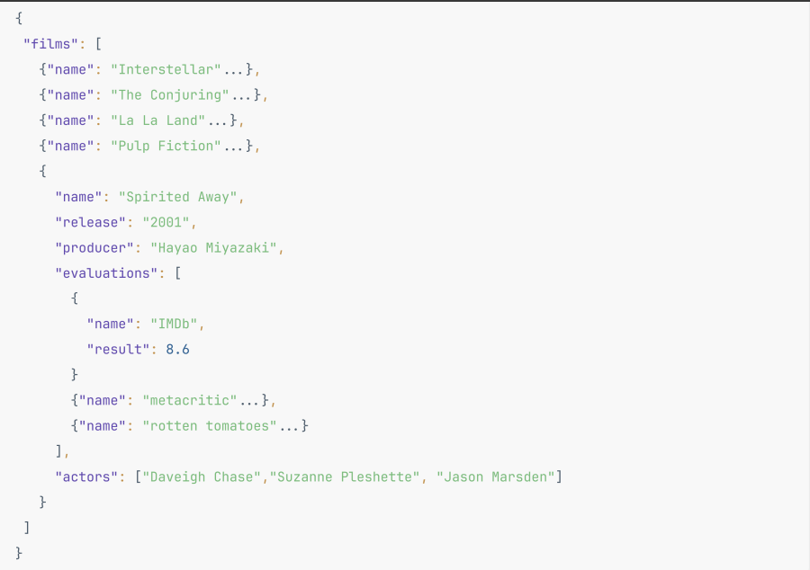
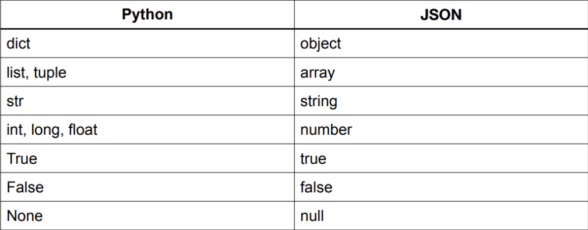

# **Работа с файлами. JSON, CSV**

**Немного про библиотеки**

**Библиотеки** - это просто набор разных значений, инструментов и функций,                   
которые облегчают некоторые специфические операции с использованием            
языка программирования.

Они существуют для облегчения нам жизни. Очень много инструментов может               
быть сокрыто в библиотеках и вместо того, чтобы самим каждый раз где-нибудь               
в начале файла прописывать одну и ту же логику, мы можем просто импортировать               
библиотеку и использовать нужные нам инструменты в ней.

Подключение библиотек у нас происходит за счёт ключегого слова `import`, который                  
позваляет нам импортировать то, что нам нужно. Дальше мы, собственно,               
что можем сделать:               

* **прописать всю библиотеку**
* **прописать определённые методы\классы из этой библиотеки**


```python
import math

print(math.pi)
```

Если вам необходим только какой-то определённый инструмент(ы) из библиотеки,               
можно использовать другой формат записи: `from <lib> import <what you need>`


```python
from math import e, pi
print(e)
print(pi)
```

Если нужно несколько инструментов - их можно просто указать через запятую                   

```python
from math import log, log2
a = 15
print(log(a), log2(a), sep="\n")
```

Если вам нужно больше двух методов сразу (и там ещё названия длинные) -                 
имеет смысл взять это всё в скобки.                         

```python
from math import (
    log,
    log2,
    log10,
    cos,
    sin,
    tan
)
b = 35

print(log(b), log2(b), log10(b), cos(b), sin(b), tan(b), sep="\n")
```

Так же, если имя вашей библиатеки содержит длинное название, или же вам просто                     
хочется дать ваше название, с которым будет удобнее работать -                    
можно использовать оператор `as`


```python
# импортируй модуль как <название переменной>
import pandas as pd
import numpy as np
import matplotlib as plt
import math as m
...
```

Многих библиотек нет по дефолту в питоне, поэтому их нужно устанавливать                           
Установка происходит в консоли, благодаря специальному пакетному                      
менеджеру `pip`

```python
# pip install <lib name>
# pip3 install <lib name>
# brew install <lib name>
# ...
```

---


# **JSON**

Такой формат файлов и данных, как **JSON** очень популярен в текущей                    
разработке и используется на всех языках при разработке                   
таких штук, как **API**.

**JSON** переводится, как **JavaScript Object Notation**. Да, нам стоит                     
благодарить за этот прекрасный формат данных именно **JavaScript**.

По синтаксису данные хранятся там, как в словаре. Сам формат данных                     
является независимым и может использоваться всеми языками                          
програмирования. Давайте разбираться что к чему.

---

---

Json написан на **JavaScript**, поэтому и типы в таком формате отличаются                         
от типов **Python**. Когда говорим про хранение данных и работе с файлом,                         
в первую очередь имеется в виду запись в файл и чтение из файла.

Для того, чтобы записать данные требуется перевести данные в формат **json**,                      
а для того чтобы прочитать - перевести из формата **json**. Такой процесс                       
называется **кодированием** и **декодированием**. А часть кода, которая эти                           
действия выполняет называется **сериализатором** и **десериализатором**


* `Сериализатор` – написанная инструкция, которая кодирует часть данных в                 
определенный формат, для успешной отправки и декодирования.

* `Десериализатор` - декодирует полученные данные для работы или хранения их.                          

Как собственно выглядят типы данных в **JSON** в сравнение с **Python**:

---

---

Для работы с **JSON** файлами в питоне есть библиотека **json**. Она входит                     
в стандартный набор файлов и модулей **python**, поэтому можно                    
просто добавить её в работу через **import**

### **Чтение и запись данных**

Для того, чтобы записать данные в **json** используется метод `dump()`                        

Такие функции имеют много параметров, и знать все не обязательно.                             

К функции `dump`, существуют параметры:                                    
* `indent`, контролирующий отступы в файле                             
* `sort_keys`, задающий сортировку ключам в файле.                          


Про остальные можно почитать в документации.


```python
import json

some_data = {
    "name": "Jarred",
    "surname": "Austin",
    "age": 32,
    "sex": "male",
    "have_work": 1,
    "household_pet": {
        "type": "cat",
        "name": "Lucky",
        "age": 2,
        "color": "black"
    }
}


with open ("man_info.json", "w") as man_info:
  json.dump(some_data, man_info)
```

Для того, чтобы данные получить, есть метод `load()`
Он позволит получить вам данные из файла(оъект, если там что-то одно                     
и список объектов, если там много данных)

```python
with open("man_info.json", "r") as data:
  res = json.load(data)

print(res)
print(type(res))
```

Если ваши **json** данные хранятся\приходят вам в формате строки, вы так же                          
можете их обработать через методы `dumps()` и `loads()` соответственно.                          

* `dumps()` - Преобразует Python-объект в **JSON-строку**.
* `loads()` - Преобразует **JSON-строку** в Python-объекты.

```python
json_string = '{"name": "Anna", "age": 24, "sex": "female", "work": 1}'
# "{'name': 'Anna', 'age': 24, 'sex': 'female', 'work': 1}" - нерабочий вариант. Json не любит строки в двойных кавычках
# '{"name": "Anna", "age": 24, "sex": "female", "work": 1}' - всё ок
data = json.loads(json_string)

print(type(data))
for key, value in data.items():
  print(key, value)
```

```python
python_data = {"name": "Anna", "age": 24, "sex": "female", "work": 1}

json_data_string = json.dumps(python_data)

print(json_data_string)
print(type(json_data_string))
```

---
## **Практика**

```
Есть файл с данными о пассажирах Титаника.
Выведите общее количество пассажиров, представленных в данных.
```

```
Из этого же файла нужно забрать информацию:
1) всех пассажиров
2) Кличество выживших и их имена
3) Количество умерших пассажиров и их имена.
```

```
Найти самого пожилого пассажира. Вывести его имя, возраст и класс каюты.
```

```
Выведите список имен всех пассажиров, чей возраст в диапазоне от 20 до 50 лет
и класс пассажира - 2-ой.
```

---

# **CSV файлы**

Формат `.csv` – один из самых распространенных форматов для                  
импорта и экспорта электронных таблиц. В большинстве случаев                        
формат универсален. Однако для обработки данных есть некоторые                       
различие форматирования. К примеру `csv` легко переводится                     
в формат `.xls` (`.xlsx`)

Для того, чтобы записывать в файлы данные, можно использовать                    
`writer` модуля `csv`.

`csv.writer` – это объект, который позволяет записывать данные                 
в `csv` файл.

Данные передаются в виде двумерного списка, каждый список -                        
это **строка**, каждый элемент - **столбец таблицы**. Далее создаем                      
`writer` и с помощью его записываем данные в файл.


```python
import csv

films_list = [
    ["id", "name", "release", "genre", "length", "rating"],
    [1, "Superman", 2012, "Fantasy", "2:10", "16+"],
    [2, "Iron Man", 2008, "Fantasy, Shooter", "1:45", "16+"],
    [3, "Scream 6", 2023, "Horror", "1:52", "18+"],
]

with open("films.csv", "w") as data:
  writer = csv.writer(data)
  writer.writerows(films_list)
```

Для записи данных в `csv` файл, можно ещё использовать **словари**. Для                       
этого необходимо создать список, в котором будут названия столбцов;                          
далее создать словарь, в котором ключ - это **название столбца**,                           
а значение - то, что записать в этот столбец.                       

Используем объект `csv.DictWriter`                          

```python
# The first way
with open("films_via_dict.csv", "w") as data:
  field_names = ["id", "name", "release", "genre", "length", "rating"]

  writer = csv.DictWriter(data, fieldnames=field_names)
  writer.writeheader() # запиши заголовки

  writer.writerow({"id": 1, "name": "Avangers", "release": 2012, "genre": "Fantasy", "length": "2:10", "rating": "16+"})
  writer.writerow({"id": 2, "name": "Avangers2", "release": 2016, "genre": "Fantasy", "length": "2:30", "rating": "16+"})
  writer.writerow({"id": 3, "name": "Avangers3", "release": 2020, "genre": "Fantasy", "length": "2:45", "rating": "18+"})
  writer.writerow({"id": 4, "name": "Avangers4", "release": 2022, "genre": "Fantasy", "length": "3:15", "rating": "18+"})
```

```python
# The second way
films_list = [
    {"id": 1, "name": "Avangers", "release": 2012, "genre": "Fantasy", "length": "2:10", "rating": "16+"},
    {"id": 2, "name": "Avangers2", "release": 2016, "genre": "Fantasy", "length": "2:30", "rating": "16+"},
    {"id": 3, "name": "Avangers3", "release": 2020, "genre": "Fantasy", "length": "2:45", "rating": "18+"},
    {"id": 4, "name": "Avangers4", "release": 2022, "genre": "Fantasy", "length": "3:15", "rating": "18+"},
]

with open("films_via_list_wiith_objects.csv", "w") as data:
  fieldnames = ["id", "name", "release", "genre", "length", "rating"]
  writer = csv.DictWriter(data, fieldnames=fieldnames)
  writer.writeheader()

  for film in films_list:
    writer.writerow(film)
```

```python
# The third way
films_list = [
    {"id": 1, "name": "Avangers", "release": 2012, "genre": "Fantasy", "length": "2:10", "rating": "16+"},
    {"id": 2, "name": "Avangers2", "release": 2016, "genre": "Fantasy", "length": "2:30", "rating": "16+"},
    {"id": 3, "name": "Avangers3", "release": 2020, "genre": "Fantasy", "length": "2:45", "rating": "18+"},
    {"id": 4, "name": "Avangers4", "release": 2022, "genre": "Fantasy", "length": "3:15", "rating": "18+"},
]

with open("films_via_writerows.csv", "w") as data:
  fieldnames = ["id", "name", "release", "genre", "length", "rating"]
  writer = csv.DictWriter(data, fieldnames=fieldnames)
  writer.writeheader()

  writer.writerows(films_list) # запиши строки
```


Для того, чтобы читать данные с наших `csv` файлов                    
есть метод `reader()`.                        

Класс `reader` предоставляет простой способ чтения **CSV-файлов**.                           
Он читает каждую строку файла и возвращает список значений,                        
разделенных запятыми или другими символами, в этой строке.                             

Для того, чтобы прочитать данные из `csv` файла безопасно                          
(корректно), следует указывать аргумент `newline = ''`                     

```python
with open("films.csv", "r", newline="") as films:
  reader = csv.reader(films)

  print(reader)
  for row in reader:
    print(row)
```

Так же, чтобы прочитать данные из файла по именам колонок                      
можно использовать класс `DictReader()`                         

Класс `DictReader` позволяет читать **CSV-файлы**, представляя каждую                           
строку данных в виде словаря, где ключи словаря соответствуют                        
заголовкам столбцов.

```python
with open("films_via_writerows.csv", "r", newline="") as data:
  reader = csv.DictReader(data)

  for row in reader:
    print(row)
    print(row["name"], row["rating"], sep="\t")
```

---

# **Ещё немного практики**

```
В файле titanic.csv подсчитать общее кол-во мужчин, женщин и детей
```

```
Найти средний возраст пассажиров в зависимости от класса билетов.
```

```
Определить процент выживших мужчин, женщин и детей (ребёнком                    
считается пассажир до 15-ти лет включительно)
```

```
Распределить всех пассажиров по портам посадки:
Значения могут быть:
"S" (Southampton),
"C" (Cherbourg)
"Q" (Queenstown)

Этих пассажиров распределить по:
мужчинам
женщинам
детям (до 15 лет включительно)

Выходные данные записать в новый csv файл
```

---

## **Удобные инструменты для работы с файлами \ данными**

Одним из наиболее инструметов для работы с файлами, в особенности                         
с расширениями `csv` \ `xml` является модуль `pandas`

`Pandas` - это мощная библиотека для анализа данных, построена                       
поверх языка программирования `Python`. Она предоставляет                          
высокоуровневые структуры данных и операции для манипуляции и                      
анализа табличных данных. Основными структурами данных в `Pandas`                           
являются объекты `Series` (ряды) и `DataFrame` (таблицы).

Он в целом очень обширен по функционалу, но одно из доступных ведений                     
разработки с ним - работа с файлами. Быстрая работа с файлами.

Он не идёт по дефолту в питоне, поэтому его нужно установить                        
перед использованием.


**Немного методов в пандасе:**

`read_csv()`: Используется для чтения данных из `CSV`                  
файла и создания DataFrame.
`head()`, `tail()`: Эти методы выводят первые или последние               
несколько строк `DataFrame`.

```python
import pandas as pd

df = pd.read_csv("train.csv")

# df.head(10)  # Выводит первые 5 строк
df.tail(10)  # Выводит последние 10 строк
```

* `shape`: Возвращает размерность `DataFrame`                   
(количество строк и столбцов).
* `info()`: Выводит информацию о `DataFrame`, включая количество                       
ненулевых значений, типы данных и память, занимаемую объектом.
* `describe()`: Выводит сводную статистику для числовых                  
столбцов `DataFrame`, включая среднее, стандартное отклонение,                   
минимум, максимум и квартили.
* `loc[]`, `iloc[]`: Используются для доступа к элементам                    
`DataFrame` по меткам (`loc`) или индексам (`iloc`).

```python
# df.head(10)  # Выводит первые 10 строк
# df.tail(10)  # Выводит последние 10 строк
# df.info()  # выведет информацию о датафрейме
# df.loc[5, "Name"]  # выведет имя пассажира из пятой строчки
# df.iloc[:5, 1:4]  # Выведет кусочек информации по первым пяти строкам, по колонкам со второй по 4(включительно)
```

* `groupby()`: Позволяет группировать данные по заданному                       
столбцу и выполнять агрегирующие операции на группах данных.                      

```python
df.groupby('Pclass').mean()  # Вычисляет среднее значение для каждой группы
```

```python
# Найти средний возраст пассажиров в зависимости от класса билетов.

import pandas as pd


df = pd.read_csv("titanic.csv")

average_age_by_class = df.groupby("Pclass")["Age"].mean()

print(average_age_by_class)
print(type(average_age_by_class))
```
