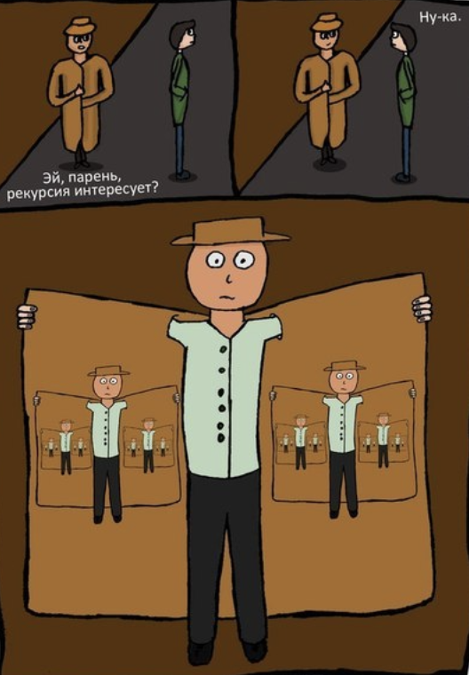

# **Виды функций**

## **Генераторы \ итераторы**

**Итеративный объект** – это объект, по которому можно совершить итерацию.

**Итераторы** – это функции либо конструкции языка, которые позволяют                         
проходиться по итеративным объектам.

Вы уже знакомы со способом прохода через цикл. Однако, если в итеративном                              
объекте хранится много значений, тогда на помощь приходит функция                         
`iter()` и `next()`, которые позволяют не хранить целый объект в памяти,                          
а извлекают его и хранят только текущий элемент.

Когда элементы в итераторе заканчиваются, вызывается                             
исключение `StopIteration`.

**Как это выглядит:**

```python
my_list = {"one", "two", "three", "four", "five", "six", "seven", "eight", "nine"}
my_iter = iter(my_list)

my_iter = iter(my_list)
print(type(my_iter))
print(next(my_iter))
print(next(my_iter))
print(next(my_iter))
print(next(my_iter))
print(next(my_iter))
print(next(my_iter))
print(next(my_iter))
print(next(my_iter))
print(next(my_iter))
# print(next(my_iter))
```

Итераторы полезны, когда мы хотим выполнять итерацию через большие                            
или бесконечные коллекции, такие как файлы, базы данных                           
или потоки данных.

**Генератор** – это функция, которая позволяет делать вам свои итераторы.

```python
def multiple_value_generator(value):
    while value < 50:
        yield value
        value *= 2


custom_generator = multiple_value_generator(2)

print(next(custom_generator))
print(next(custom_generator))
print(next(custom_generator))
print(next(custom_generator))
print(next(custom_generator))
print(next(custom_generator))
```

Генераторы очень эффективны, когда нам нужно производить значения по                         
мере необходимости, а не все сразу. Они также помогают сэкономить                      
память, так как не требуют хранения всех значений в памяти одновременно.

Генераторы могут быть бесконечными, и их выполнение может продолжаться                          
до бесконечности. Мы можем ограничить количество итераций с помощью                         
функции `range()` или условного оператора.

Генераторы также могут быть использованы вместе с различными функциями,                           
такими как `map()`, `filter()` и `reduce()`, чтобы создавать компактный                            
и выразительный код.

**Вот некоторые способы применения генераторов и итераторов:**

* Постепенная обработка больших объемов данных, таких как чтение                         
  больших файлов или баз данных по мере необходимости.
* Ленивая загрузка данных из внешних источников.
* Генерация итерируемых последовательностей с определенными                                
  правилами или условиями.
* Фильтрация или преобразование элементов в коллекции.
* Рекурсивные итерации без использования рекурсивных вызовов                            
  функций, чтобы избежать переполнения стека.

**Задача:**                                
Фильтрация данных из базы данных. Реализуйте итератор, который                            
позволяет получать только те записи из базы данных, где возраст                           
пользователя больше 18. ID этих пользователей записать в список                                
`users_white_list` для передачи фронту

```python
database_data = [
    {"id": 1, "username": "user123", "email": "user123@example.com", "age": 25},
    {"id": 2, "username": "john_doe", "email": "johndoe@example.com", "age": 15},
    {"id": 3, "username": "emma_s", "email": "emma_s@example.com", "age": 42},
    {"id": 4, "username": "alex21", "email": "alex21@example.com", "age": 21},
    {"id": 5, "username": "lisa_smith", "email": "lisa.smith@example.com", "age": 30},
    {"id": 6, "username": "max_power", "email": "max_power@example.com", "age": 15},
    {"id": 7, "username": "sara_m", "email": "saram@example.com", "age": 28},
    {"id": 8, "username": "brian88", "email": "brian88@example.com", "age": 33},
    {"id": 9, "username": "julia_c", "email": "juliac@example.com", "age": 17},
    {"id": 10, "username": "sam99", "email": "sam99@example.com", "age": 14},
    {"id": 11, "username": "megan_ross", "email": "megan.ross@example.com", "age": 23},
    {"id": 12, "username": "mark_johnson", "email": "markjohnson@example.com", "age": 17},
    {"id": 13, "username": "amy_w", "email": "amy_w@example.com", "age": 18},
    {"id": 14, "username": "chris25", "email": "chris25@example.com", "age": 25},
    {"id": 15, "username": "natalie_g", "email": "natalieg@example.com", "age": 14},
    {"id": 16, "username": "michael_b", "email": "michaelb@example.com", "age": 19},
    {"id": 17, "username": "lucas34", "email": "lucas34@example.com", "age": 27},
    {"id": 18, "username": "olivia_smith", "email": "olivia.smith@example.com", "age": 14},
    {"id": 19, "username": "david_p", "email": "davidp@example.com", "age": 21},
    {"id": 20, "username": "sophie_w", "email": "sophiew@example.com", "age": 17},
    {"id": 21, "username": "ryan_miller", "email": "ryan.miller@example.com", "age": 35},
    {"id": 22, "username": "lily_g", "email": "lilyg@example.com", "age": 14},
    {"id": 23, "username": "patrick_s", "email": "patricks@example.com", "age": 37},
    {"id": 24, "username": "grace41", "email": "grace41@example.com", "age": 41},
    {"id": 25, "username": "daniel_h", "email": "danielh@example.com", "age": 15},
    {"id": 26, "username": "victoria99", "email": "victoria99@example.com", "age": 24},
    {"id": 27, "username": "jacob_t", "email": "jacobt@example.com", "age": 14},
    {"id": 28, "username": "sophia_c", "email": "sophiac@example.com", "age": 16},
    {"id": 29, "username": "andrew_j", "email": "andrewj@example.com", "age": 23},
    {"id": 30, "username": "emily_rose", "email": "emily.rose@example.com", "age": 17},
]
```

**Задача:**                                   
Генерация уникальных идентификаторов. Напишите генератор, который создает                            
уникальные идентификаторы для объектов, добавляемых в систему. Уникальный                                
идентификатор может быть строкой или числом и должен гарантировать                              
уникальность для каждого нового объекта.

---

## **Итеративные и генеративные выражения:**

`Итеративные и генеративные выражения` – это списковые включения для                              
упрощения читабельности и сокращения кода, такие включения можно                             
делать для списков, словарей, множеств, генераторов.

**Шаблон спискового включения:**

`[возвращаемое_значение цикл условие_не_обязательно]`

`Итеративное выражение` – это списковое включение, которое работает                             
уже с существующим итерируемым объектом.

Итеративные выражения используются для создания итерируемых объектов                             
с помощью синтаксиса списка (**list comprehension**) или                                
множества (**set comprehension**). Они позволяют нам создавать последовательности                              
значений на основе других последовательностей или итерируемых объектов.

Итеративные выражения создают новую последовательность значений и могут                               
быть преобразованы в конкретные коллекции данных, такие как списки,                            
множества или кортежи.

**Генеративные выражения** используются для создания генераторов - итерируемых                               
объектов, которые генерируют значения по мере необходимости, без                         
хранения всех значений в памяти.

Генераторы используют ключевое слово `yield`, чтобы вернуть значения и                           
сохранить состояние выполнения функции.

Генеративные выражения возвращают генераторы, которые могут быть использованы                           
в циклах `for` или получать значения с помощью функции `next()`. Они особенно                              
полезны, когда требуется работать с большими объемами данных или                               
генерировать значения по требованию без необходимости хранения всех                            
значений в памяти.

**Синтаксис итеративных и генеративных выражений в `Python` очень**                              
**похож, но есть некоторые различия:**

1) **Синтаксис:**
   `Итеративное выражение:` Используется в квадратных скобках `[]` или                       
   фигурных скобках `{}` для создания списка или множества.

`Генеративное выражение:` Используется в круглых скобках `()`                                 
для создания генератора.

2) **Использование:**

`Итеративное выражение:` Создает новую коллекцию данных (список,                           
множество и т. д.), которая может быть использована непосредственно.

`Генеративное выражение:` Создает генератор, который генерирует                               
значения по требованию и сохраняет состояние выполнения функции.

3) **Хранение значений**

`Итеративное выражение:` Создает и хранит все значения в памяти,                            
чтобы вернуть коллекцию данных целиком.

`Генеративное выражение:` Генерирует значения по мере необходимости,                          
сохраняя минимальное состояние в памяти.

4) **Использование в циклах:**

`Итеративное выражение:` Можно использовать напрямую в цикле `for`                                
для итерации по всем элементам коллекции.

`Генеративное выражение:` Необходимо использовать функцию `next() `                                
или включить генератор в цикл `for` для получения значений.

5) **Возможности:**

`Итеративное выражение:` Позволяет преобразовывать и фильтровать                          
значения, а также создавать новую коллекцию данных.

`Генеративное выражение:` Позволяет генерировать значения на лету                              
и эффективно работать с большими объемами данных.

**Создание списка квадратов чисел:**
Через `list comprehension` создать список с числами, где каждое число                            
возведено в квадрат

**Фильтрация списка четных чисел:**
Принять от пользователя числа через запятую
преобразовать их в список чисел
отфильтровать список через `list comprehansion`

**Вычисление суммы квадратов четных чисел:**
Есть список чисел, вычислить сумму его чётных чисел:                                     

```python
numbers = [1, 2, 3, 4, 5, 6, 7, 8, 9, 10]
```
---

## **Вложенные функции**

**Вложенные функции** - это функции, которые находятся друг в друге.                             
Такие функции могут быть использованы только внутри родительской.                              
Благодаря этому можно добиться взаимодействия между функциями                              
вместе с их общими аргументами.

```python
def printer(value: int) -> None:
    def print_hello() -> None:
        print("Hello, ")

    def print_world() -> None:
        print("World!")

    if value == 1:
        print_hello()

    else:
        print_world()


printer(2)
```

## **Декораторы**

**Декораторы** - это мощный инструмент в `Python`, который позволяет изменять                                    
поведение функций или методов класса, не изменяя их собственный код. Они                             
представляют собой функции, которые принимают другую функцию или метод в                             
качестве аргумента и возвращают новую функцию или метод, обогащенную                           
дополнительной логикой.

Декораторы обычно используются для добавления                               
функциональности, логирования, аутентификации, проверки прав доступа и                            
других аспектов, не изменяя исходный код функции или метода.

Декораторы позволяют разделять код функций и дополнительную логику,                                     
что делает код более читаемым и поддерживаемым.

**Декораторы предоставляют несколько преимуществ:**

`Разделение функциональности:` Декораторы позволяют разделить различные                                  
аспекты функциональности, такие как логирование, аутентификация и валидация,                            
от основной логики функции. Это делает код более структурированным и понятным.

`Многократное использование:` Декораторы могут быть использованы на нескольких                                     
функциях или методах, что упрощает повторное использование кода.

`Упрощение чтения кода:` Декораторы позволяют добавлять дополнительную                                  
логику к функциям, не засоряя их собственный код. Это улучшает читаемость                                   
кода и делает его более понятным.

Для определения декоратора, вы должны создать функцию, которая принимает                           
другую функцию в качестве аргумента и возвращает новую функцию, которая                                 
может быть вызвана вместо оригинальной функции. Эта новая функция обычно                            
содержит дополнительную логику перед или после вызова оригинальной функции.

**Так же декораторы могут работать с функциями с аргументами:**

```python
def greet(name):
    return f"Привет, {name}"
```

```python
def exclamation_decorator(func):
    def wrapper(name):
        result = func(name)
        return result + ". Nice to meet with you!!!!!"

    return wrapper
```

Декораторы мы можем вызывать не только через спец символ `@`, но и при определении                         
переменной:

```python
my_dec = exclamation_decorator(greet)
print(my_dec("Vlad"))
```

**Стекирование декораторов**

**Стекирование декораторов** - это процесс применения нескольких декораторов                            
к одной функции или методу. Вы можете создавать сложные цепочки декораторов,                            
чтобы комбинировать различные аспекты функциональности. Порядок,                               
в котором вы стекируете декораторы, важен, и он определяет,                             
какие преобразования будут применены к функции.

Вложенные декораторы предоставляют мощный способ добавлять функциональность                          
и изменять поведение функций и методов в Python, позволяя создавать                            
гибкий и читаемый код. Они особенно полезны при работе с различными                             
аспектами приложения, такими как логирование, валидация, кеширование                              
и многое другое.

**Так же декораторы могут содержать в себе аргументы**

Декораторы с аргументами реализуются с помощью двух уровней функций:                               
внешней функции, которая принимает аргументы декоратора, и внутренней                             
функции-декоратора, которая принимает функцию для декорирования.

---

**Область видимости переменных**

Все переменные, которые мы объявляем в функции, включая её                              
аргументы, являются локальными, а это значит, что обратиться                                
к ним можно только внутри функции, за функцией они не существуют.

Глобальные переменные объявляются внутри функции и работают, а                               
также хранят значения полученные в функции за ней, учтите что                               
использовать такие переменные не всегда безопасно.

**Всего есть 4 области видимости переменных:**

`Build-in` - уровень сборки вашего питона
`Уровень файла` (глобальные переменные)
`Локальные переменные` (в блоке кода)
`Замкнутые переменные` переменные, закрытые внутри функции

**Рекурсии**



---

**Рекурсия** – это подход в программировании, при котором функция вызывает                           
сама себя. Любую рекурсивную функцию можно представить как цикл, а                         
цикл можно представить как рекурсию.

**Преимущества рекурсии:**

1) каждый новый вызов функции в функции начинается с чистого листа,                            
   а значения из предыдущих вызовов отдаются в стек.
2) код, написанный через рекурсию читается проще. Решения выглядит лучше.

**Недостатки рекурсии:**

1) размер стека, которому проталкиваются элементы из каждого                        
   вызова не безграничен.
2) рекурсию трудно представить, если рекурсия спроектирована плохо,                         
   она может убить ваше приложение или сильно его замедлить.

**Правила создания рекурсий:**

1) рекурсия не должна создавать больше чем 3000 слоев (вызовов)
2) у рекурсии всегда должно быть условие остановки
3) использовать рекурсию, для того чтобы решение становилось меньше и понятнее
4) использовать рекурсию, когда знаешь глубину вызов
5) если код читает другой человек, выбор в пользу рекурсии                         
   (код красивее и понятнее)
6) если скорость не так важна выбор в пользу рекурсии

```python
# пример рекурсии

def greeting(value: int) -> None:
    if value == 0:
        return 0
    print(f"Hello! This is recursion! {value}")
    greeting(value - 1)
```


**Создание декоратора для измерения времени выполнения функции.**
Напишите декоратор, который будет измерять время выполнения функции                              
и выводить его на экран. Затем примените этот декоратор к любой                            
функции, чтобы измерить ее время выполнения.                              


**Создание декоратора для логирования.**
Напишите декоратор, который будет записывать в файл логи информацию о                          
вызовах функции, а именно ее имя и переданные аргументы. Затем                           
примените этот декоратор к нескольким функциям и проверьте,                     
что логи записываются правильно.                        


**Создание декоратора для ограничения доступа.**
Напишите декоратор, который будет проверять, имеет ли пользователь                             
доступ к выполнению определенной функции. Для простоты можно                             
предположить, что у вас есть список пользователей с определенными                            
правами. Если пользователь имеет право, функция выполняется;                                  
в противном случае выводится сообщение об ошибке.


**Создание декоратора с параметрами.**                     
Напишите декоратор, который можно настроить с помощью параметров.                                
Например, декоратор может принимать параметр n, который указывает                               
максимальное количество раз, которое функция может быть вызвана.                            
Если функция вызывается более n раз, декоратор должен выводить                               
сообщение об ошибке.


**Вычисление факториала числа.**
Напишите функцию, которая вычисляет факториал числа                       
n с использованием рекурсии.                


**Подсчет суммы элементов списка.**
Напишите функцию, которая рекурсивно вычисляет сумму                        
всех элементов списка целых чисел.                      

**Вычисление чисел Фибоначчи.**
Напишите функцию, которая рекурсивно вычисляет n-ное                             
число в последовательности Фибоначчи.                       
